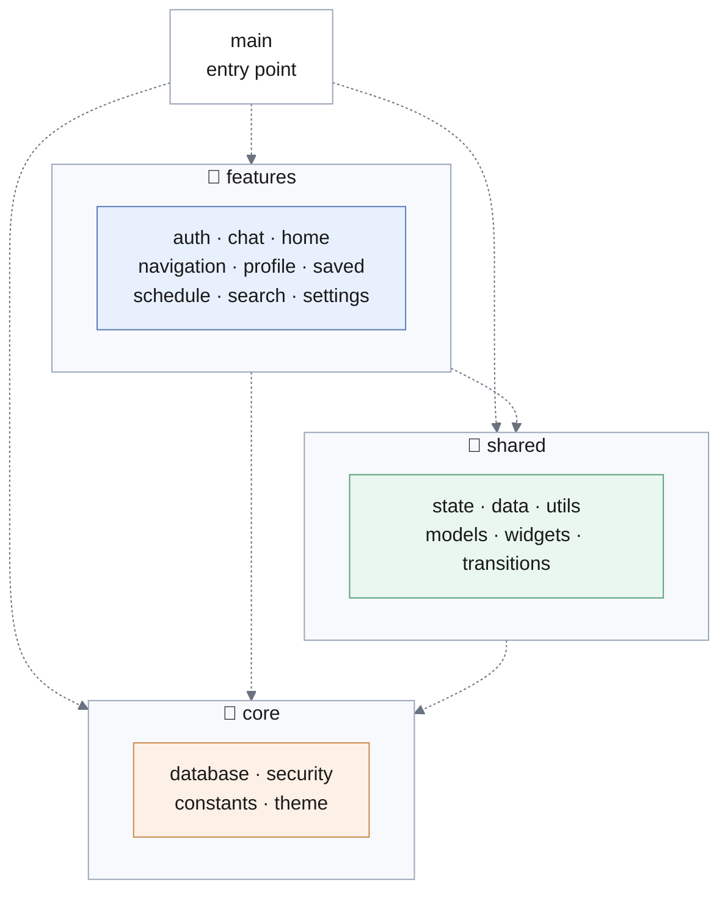

# 2. Packages

The source is organised into three top-level packages — `core`, `shared` and `features` — each holding the classes of one or more subsystems of [SDD 3.2](../sdd/proposed-architecture/subsystem-decomposition). A package is a directory of the source tree, and every class belongs to exactly one.

## The three packages

| Package | Holds | Subsystems it realises |
|---------|-------|------------------------|
| **`core`** | The mechanisms the application is built on: storage commands, encryption, and the fixed values of the interface | Data Access, Security |
| **`shared`** | What is used by more than one screen: application state, domain rules, domain objects, persistence, reusable widgets | Application State, Domain Logic, Persistence |
| **`features`** | One directory per area of the interface, each holding the screens of that area | Presentation, Media Storage |

The division is by **reason to change**, not by kind of file. A class belongs to `core` when it would change because a mechanism changed, to `shared` when it would change because a rule of the domain changed, and to `features` when it would change because a screen changed.

## Package diagram

Each dashed arrow is a **use** dependency: the package at the tail names classes of the package at the head, and never the reverse.

## Dependencies

| Package | Depends on | Depended on by |
|---------|-----------|----------------|
| **`core`** | Nothing within the application | `shared`, `features`, `main` |
| **`shared`** | `core` | `features`, `main` |
| **`features`** | `shared`, `core` | `main` |

Three properties follow, and each is a requirement on the classes specified in [3. Class Interfaces](./class-interfaces/) rather than an observation about them.

**The graph has no cycles.** Dependencies run in one direction only. `core` names nothing outside itself, so it can be compiled and tested alone; `shared` names `core` but never `features`, so the domain rules and the application state can be tested without a single screen.

**`shared` never names `features`.** This is what keeps the rule of [SDD 3.1](./../sdd/proposed-architecture/overview) — that no layer addresses the one above it — checkable rather than merely intended: a class in `shared` that needed a screen would have to import `features`, and the import would be visible.

**`main` names all three.** The entry point is the one place permitted to know every package, because it is where the application is assembled: it starts the state-owning classes of `shared`, then hands control to a screen of `features`. Assembly is a responsibility, and it is confined to one file.

## Contents

Each directory below is required to hold the components named for it, and a component named here appears in no other directory. The interfaces are marked, since it is those — not the classes implementing them — that the rest of the system is permitted to depend on. Full specifications are given in [3. Class Interfaces](./class-interfaces/).

### `core`

| Directory | Key interfaces and components | Purpose |
|-----------|-------------------------------|---------|
| `core/database` | `DatabaseHelper`; *interfaces* `ProfileDao`, `AccountDao`, `ChatDao`, `TripDao`, each with one implementation over the database engine | Issues storage commands and owns the connection |
| `core/security` | `AesCipher`, `PasswordHasher`, `ProfileKeyProvider`; *interface* `SecureKeyStore` with one implementation over the OS key store | Encrypts, derives credential values, and obtains the key |
| `core/constants` | `AppStrings`, `AppColors`, `AppSizes` | Holds the fixed values of the interface in one place |
| `core/theme` | `AppTheme`, `AppTextStyles` | Fixes the visual conventions applied across every screen |

### `shared`

| Directory | Key interfaces and components | Purpose |
|-----------|-------------------------------|---------|
| `shared/state` | `AuthService`, `PersonalProfileStore`, `PrivacySettingsStore`, `SavedTripPreviewStore`, `ChatStore`, `TripStore`, `SearchResearchModeStore` | Owns application state and publishes its changes |
| `shared/data` | *interfaces* `ProfileDataSource`, `ChatDataSource` with their implementations; `ProfileRepository`, `AccountRepository`, `ChatRepository`, `TripRepository`; the built-in catalogues seeded on a first run | Chooses where data is held, and translates between domain objects and rows |
| `shared/models` | `PersonalProfile`, `MateProfile`, `TripTileData`, `ChatMessage`, `PrivacySettings`, `SavedTripPreview`, `TripTag` | The domain objects, immutable |
| `shared/utils` | `AccountValidation`, `TagInput`, and the ranking, reply-selection and proposal-matching operations | The rules of the domain, holding no state |
| `shared/widgets` | The interface elements used by more than one screen | Prevents a shared element from being defined twice |
| `shared/transitions` | `AppTransitions` | Fixes how one screen gives way to another |

### `features`

| Directory | Key interfaces and components | Purpose |
|-----------|-------------------------------|---------|
| `features/auth` | `LoginScreen`, `CreateAccountScreen` | Entry and account creation |
| `features/navigation` | `NavigationController`, `NavigationScope`, `NavigationShell` | Holds the principal destinations and publishes the selected one |
| `features/home` | `HomeScreen` | Recommended and recently consulted trips |
| `features/search` | `SearchScreen`, `SearchResultsScreen`, `SearchModeView`, `MateDetailsScreen` | Searching for trips and companions |
| `features/chat` | `ChatScreen` | One conversation |
| `features/saved` | `SavedItemsScreen` | Saved items |
| `features/schedule` | `TravelScheduleScreen` | The itinerary of a trip |
| `features/profile` | `PersonalProfileScreen` | The personal profile |
| `features/settings` | `SettingsScreen`, `PrivacySettingsScreen`, `SupportScreen` | Settings, privacy preferences and support |
| `features/profile/image` | `ProfileImageStorage`; `ProfileImagePicker` | **Media Storage, not Presentation** — see below |

`features/profile/image` is listed apart because it does not belong to Presentation. It holds the two components of Media Storage, which [SDD 3.2](./../sdd/proposed-architecture/subsystem-decomposition) places in layer 3 and permits layer 1 to address directly. That exception is the reason these two sit beneath `features` while belonging to a lower layer, and it is confined to them: no other directory of `features` holds a component of any layer but the first.

## External libraries

Each external library is used from one package only, so that the code depending on a platform facility is confined and can be identified by directory.

| Package | Libraries used |
|---------|----------------|
| **`core`** | `sqflite`, `flutter_secure_storage`, `encrypt`, `pointycastle`, `path`, `path_provider` |
| **`shared`** | `shared_preferences`, `flutter_svg` |
| **`features`** | `image_picker`, `path`, `path_provider`, `flutter_svg` |

The concentration in `core` is the intended result: the database engine, the OS key store and both cryptographic libraries are named there and nowhere else. The three named from `features` are all used by Media Storage, which obtains a file from the gallery and copies it into the application's own directory.
