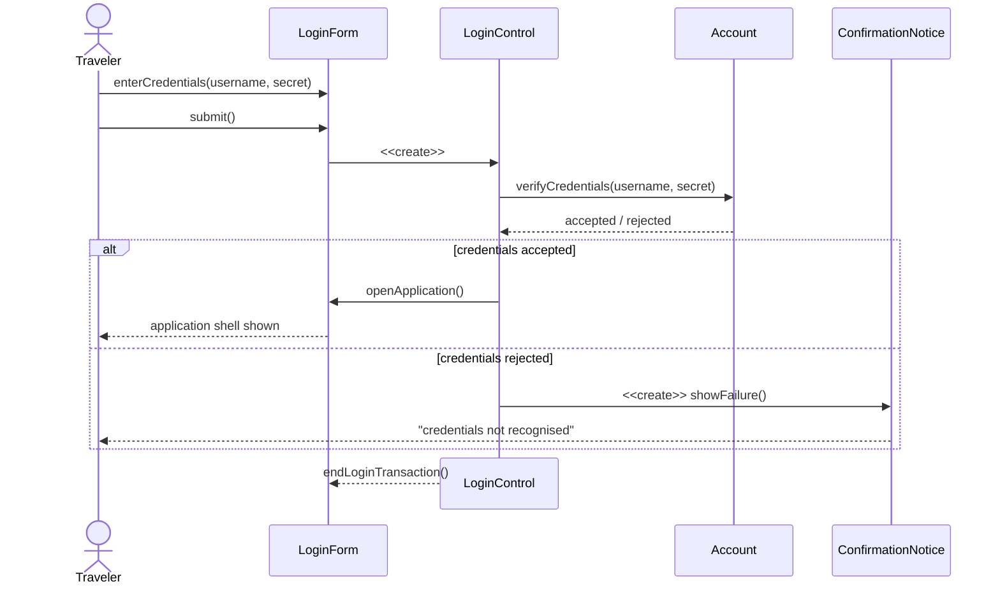
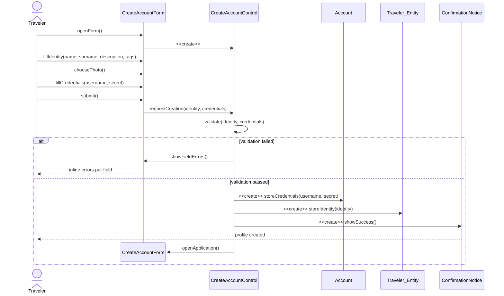
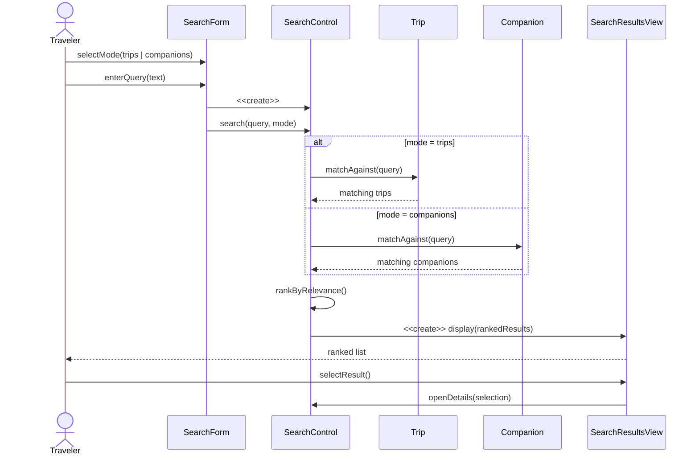
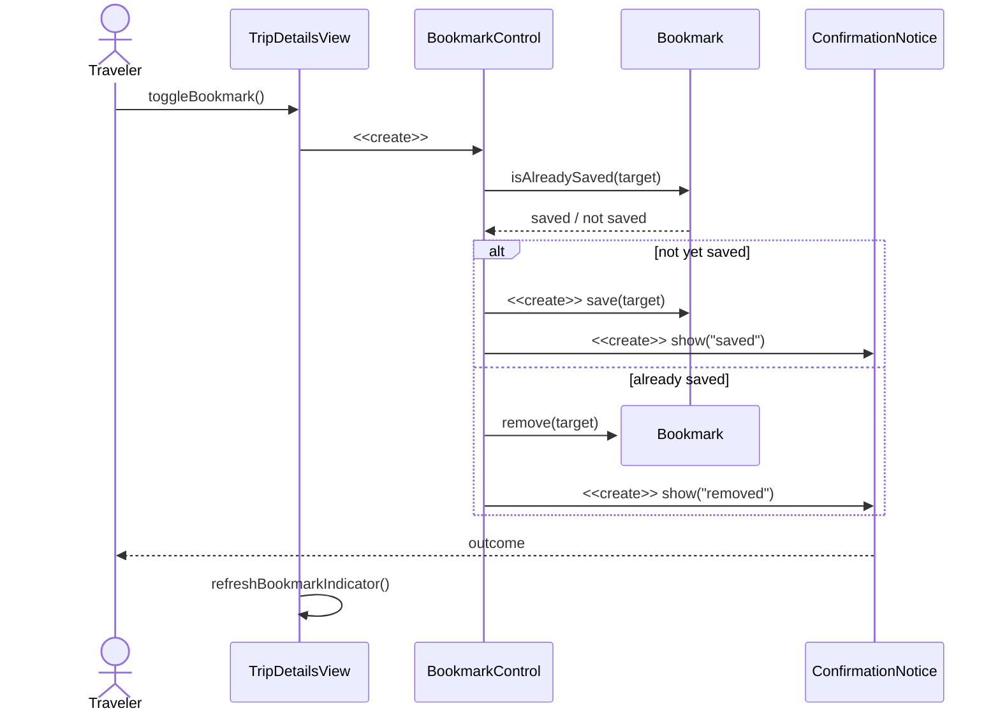
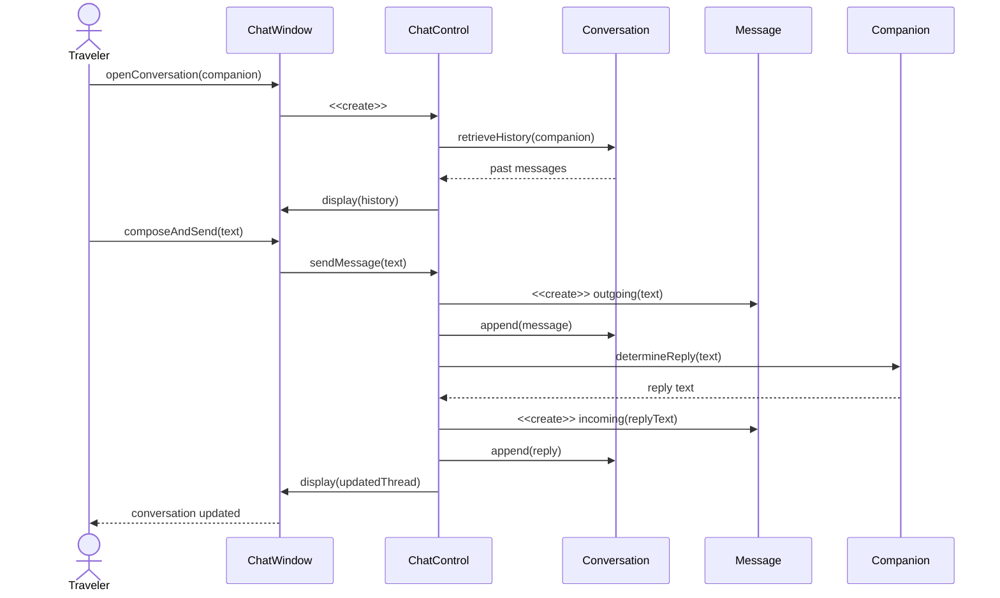
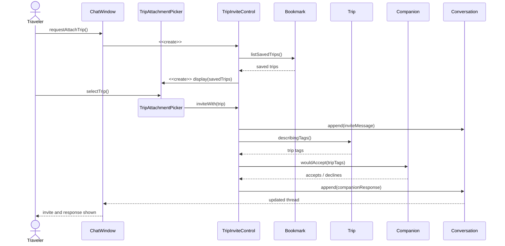
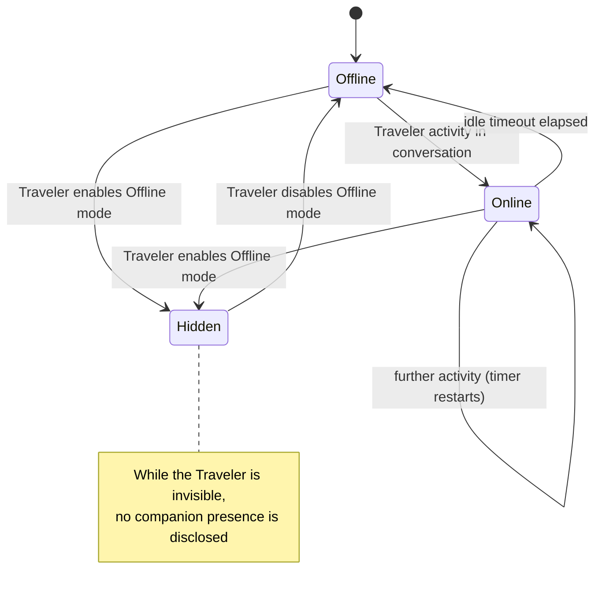
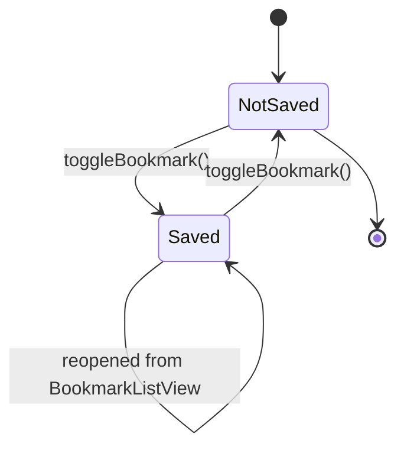

# 3.4.4 Dynamic Model

The diagrams distribute responsibilities among the analysis objects identified in [3.4.3](./object-model). Every sequence follows the flow **Actor → Boundary → Control → Entity**: the actor addresses only a boundary, controls orchestrate the use case, and entities never send messages back to controls or boundaries.

## 3.4.4.1 Sequence Diagram — Log In (UC2)

**Responsibilities assigned.** `LoginForm` collects and submits; `LoginControl` owns the flow and decides the outcome; `Account` answers only the question "do these credentials match?" and never drives navigation.

## 3.4.4.2 Sequence Diagram — Create Account (UC1)

**Note on the model.** Validation is a responsibility of the **control**, not of the entities: it concerns the use case (is this submission acceptable?) rather than the domain concepts themselves.

## 3.4.4.3 Sequence Diagram — Search Trips and Companions (UC3)

## 3.4.4.4 Sequence Diagram — Save a Bookmark (UC4)

## 3.4.4.5 Sequence Diagram — Converse with a Companion (UC5)

## 3.4.4.6 Sequence Diagram — Share a Trip in a Conversation (UC6)

**Object discovered through this diagram.** Building this sequence made explicit that the decision to accept or decline is a *domain* judgement belonging to the **Companion** (it depends on that companion's own tags), not a rule of the chat use case. The responsibility was therefore assigned to the `Companion` entity rather than to `TripInviteControl` — an example of the sequence diagram refining the object model.

## 3.4.4.7 Statechart — Companion Presence

The presence indicator shown beside a companion's name is state-dependent behaviour of a single object, and is therefore modelled as a statechart.

## 3.4.4.8 Statechart — Bookmark Lifecycle

## 3.4.4.9 Envisioned Dynamic Behaviour (deferred)

The following flows belong to the envisioned platform and are not realised by the delivered system.

- **Token-based authentication**: credentials are validated by a remote service that issues a session token with a limited lifetime, refreshed transparently by the client.
- **Compatibility matching**: candidate travellers are scored on shared interests, destination overlap, travel style, and availability, then ranked by the resulting compatibility percentage.
- **Real-time messaging**: a message is delivered over the network to a second real Traveler, who is notified, and whose reading of the message updates the sender's view with a read receipt.
