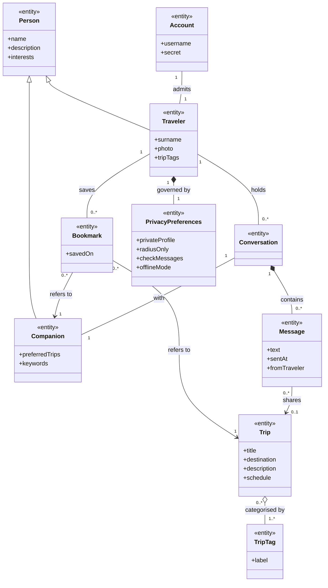

# 3.4.3 Object Model

Objects are classified with the Entity–Boundary–Control pattern and carry the corresponding UML stereotypes.

## 3.4.3.1 Actors

| Actor | Description |
|-------|-------------|
| **Traveler** | The person using the application: browses trips and companions, saves them, maintains their own profile, and converses with companions. The only actor of the delivered system. |
| **Administrator** *(deferred)* | Reviews reports, moderates content, and suspends accounts. |
| **Companion as a real user** *(deferred)* | A second real Traveler at the other end of a conversation. In the delivered system companions are catalogue data and are **not** actors: their replies are produced by the system. |

## 3.4.3.2 Entity Objects

Identified by applying **Abbott's heuristic** to the scenarios and use cases (common nouns → candidate classes), then retaining only those that represent domain concepts or persistent data.

| `<<entity>>` | Domain meaning | Key attributes |
|--------------|----------------|----------------|
| **Person** *(abstract)* | Generalisation of anyone with a travel identity | name, description, interests |
| **Traveler** | The account holder's own travel identity | surname, photo, tripTags |
| **Companion** | A potential travel mate offered by the system | preferredTrips, keywords |
| **Account** | The credentials that admit the Traveler to the application | username, secret |
| **Trip** | A travel itinerary that can be browsed and shared | title, destination, description, schedule |
| **TripTag** | A reusable category label describing a trip's character | label |
| **Bookmark** | A Traveler's saved reference to a trip or a companion | savedOn |
| **Conversation** | The exchange between the Traveler and one Companion | — |
| **Message** | A single utterance within a conversation | text, sentAt, fromTraveler |
| **PrivacyPreferences** | The Traveler's visibility choices | privateProfile, radiusOnly, checkMessages, offlineMode |

**Candidate nouns deliberately rejected** (following the guidance that not every noun is an entity): *system*, *application*, *database*, *screen*, *button*, *catalog*, *key* — these denote either the system itself, presentation artefacts, or implementation mechanisms.

## 3.4.3.3 Boundary Objects

Boundary objects model the **interaction** between the Traveler and the system, expressed in the user's language. They deliberately say nothing about layout, colours, or widget positioning, which are covered by the mock-ups in [3.4.5](./ui-navigational-paths).

| `<<boundary>>` | Purpose |
|----------------|---------|
| **LoginForm** | Collects credentials to enter the application |
| **CreateAccountForm** | Collects a new identity and its credentials |
| **HomeView** | Presents recommended and recently viewed trips |
| **SearchForm** | Accepts a search query and the trips/companions mode |
| **SearchResultsView** | Presents ranked results |
| **CompanionProfileView** | Presents a companion's identity and tags |
| **TripDetailsView** | Presents a trip's schedule, tags, and description |
| **BookmarkListView** | Presents everything the Traveler has saved |
| **ChatWindow** | Presents a conversation and accepts new messages |
| **TripAttachmentPicker** | Lets the Traveler choose a saved trip to share |
| **ProfileEditorForm** | Accepts changes to the Traveler's own identity |
| **PrivacySettingsView** | Presents and toggles privacy preferences |
| **ConfirmationNotice** | Communicates the outcome of an action back to the Traveler |

## 3.4.3.4 Control Objects

Following the heuristic of **one control object per use case**, each control coordinates boundaries and entities for the duration of its use case and holds no domain data of its own.

| `<<control>>` | Coordinates the use case |
|---------------|--------------------------|
| **CreateAccountControl** | UC1 — Create Account |
| **LoginControl** | UC2 — Log In |
| **SearchControl** | UC3 — Search Trips and Companions |
| **BookmarkControl** | UC4 — Save a Trip or Companion |
| **ChatControl** | UC5 — Converse with a Companion |
| **TripInviteControl** | UC6 — Share a Trip in a Conversation |
| **ProfileEditControl** | UC7 — Manage Profile and Settings |

## 3.4.3.5 Analysis Class Diagram

### Associations, roles and multiplicities

| Association | Roles | Multiplicity | Rationale |
|-------------|-------|--------------|-----------|
| Account **admits** Traveler | credentials / holder | 1 – 1 | One local identity per installation |
| Traveler **saves** Bookmark | owner / saved item | 1 – 0..* | A Traveler may save any number of items |
| Bookmark **refers to** Trip \| Companion | reference / target | 0..* – 1 | Each bookmark points at exactly one target |
| Trip **categorised by** TripTag | trip / category | 0..* – 1..* | Tags are shared across trips |
| Traveler **holds** Conversation | participant / thread | 1 – 0..* | One conversation per companion contacted |
| Conversation **with** Companion | thread / counterpart | 1 – 1 | Conversations are one-to-one |
| Conversation **contains** Message | thread / utterance | 1 – 0..* | Messages belong to exactly one thread |
| Message **shares** Trip | invite / subject | 0..* – 0..1 | A message optionally carries a trip invite |

### Aggregation vs composition

- **Composition** (filled diamond) — `Conversation ◆— Message` and `Traveler ◆— PrivacyPreferences`: the parts have no independent existence. Clearing a conversation destroys its messages; privacy preferences are meaningless without their owner.
- **Aggregation** (hollow diamond) — `Trip ◇— TripTag`: tags belong to a shared vocabulary, exist independently of any single trip, and are reused across many trips.

### Generalisation

`Person` factors out what a **Traveler** and a **Companion** have in common — a name, a description, and a set of interests — removing duplication from the model. The specialisations add only what distinguishes them: a Traveler additionally owns a surname, a photo and trip tags, while a Companion carries the preferred-trip and keyword information used to rank it in searches.

### Redundant associations removed

`Traveler → Trip` ("has saved trips") is **not** modelled: it is already derivable from the chain `Traveler → Bookmark → Trip`. Likewise `Traveler → Message` is derivable from `Traveler → Conversation → Message`. Modelling them explicitly would add complexity without adding information.

## 3.4.3.6 Traceability to the implementation

> Provided for V-Model verification only; it is **not** part of the analysis model. Design-level structures (persistence schema, data-access objects, cryptographic components) are specified in the SDD and ODD.

| Analysis entity | Realised by |
|-----------------|-------------|
| Traveler | `PersonalProfile` |
| Companion | `MateProfile` |
| Account | `account` record managed by `AccountRepository` |
| Trip / TripTag | `TripTileData` / `TripTag` |
| Bookmark | `SavedTripPreview` |
| Conversation / Message | conversation map in `ChatStore` / `ChatMessage` |
| PrivacyPreferences | `PrivacySettings` |
