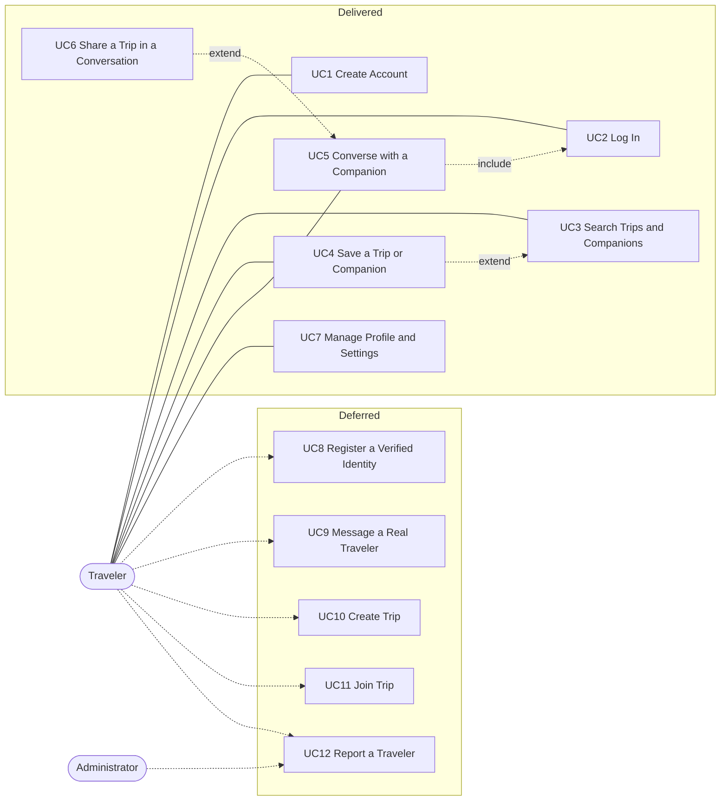

# 3.4.2 Use Case Model

Each use case is specified by its name, participating actors, assumptions, entry condition, flow of events, exceptions, and exit condition. The flow separates what the actor does from what the system does. Exceptions are stated apart from the main flow rather than mixed into it.

Use cases marked **(deferred)** require a server or a second real Traveler and are not delivered by this lifecycle; they are specified in outline only.

## Use Case Diagram

**Relationships.** Saving (UC4) *extends* searching (UC3): a Traveler may save a result, but a search is complete without it. Sharing a trip (UC6) *extends* conversing (UC5) for the same reason. Conversing *includes* logging in, since no conversation is reachable without an admitted Traveler.

## UC1 — Create Account

**Participating actor:** Traveler
**Assumptions:** The Traveler has the application installed and is not currently admitted.
**Entry condition:** The Traveler is at the login screen and chooses to create an account.

| Traveler | System |
|----------|--------|
| 1. Requests to create an account. | 2. Presents a form for a travel identity — name, surname, description, interest and trip labels, photograph — together with a username and a secret. |
| 3. Supplies the identity fields. | |
| 4. Optionally chooses a photograph from the device. | 5. Retains the chosen photograph as part of the form. |
| 6. Supplies a username and a secret, and submits the form. | 7. Validates every field. |
| | 8. Records the credentials in a form from which the secret cannot be recovered, records the travel identity, and admits the Traveler. |

**Exceptions:**
- *A field is unacceptable.* The system reports, beside each offending field, what is wrong with it; no account is created and the values already supplied are retained for correction.
- *The photograph cannot be obtained.* The system reports the failure and leaves the rest of the form intact; the Traveler may submit without a photograph.

**Exit condition:** The Traveler is admitted under the newly created identity, which replaces any account previously held.

*Realised by:* `CreateAccountScreen`, `AuthService`, `AccountValidation`.

## UC2 — Log In

**Participating actor:** Traveler
**Assumptions:** An account exists; one is provided on first installation.
**Entry condition:** The Traveler opens the application, which presents the login screen.

| Traveler | System |
|----------|--------|
| 1. Supplies a username and a secret and submits them. | 2. Compares the username with the stored account, disregarding letter case. |
| | 3. Checks the supplied secret against the stored account without recovering the original. |
| | 4. Admits the Traveler to the application. |

**Exceptions:**
- *The username is not recognised, or the secret does not match.* The system reports that the credentials were not recognised, without indicating which of the two was at fault, and remains at the login screen.

**Exit condition:** The Traveler is admitted to the application, or remains at the login screen and may try again.

*Realised by:* `LoginScreen`, `AuthService`, `AccountRepository`.

## UC3 — Search Trips and Companions

**Participating actor:** Traveler
**Entry condition:** The Traveler is admitted and opens the search function.

| Traveler | System |
|----------|--------|
| 1. Chooses whether to search trips or companions. | |
| 2. Enters a query. | 3. Retains the candidates matching every term of the query. |
| | 4. Ranks them by how closely and in which field each term matches, resolving equal ranks alphabetically. |
| | 5. Presents the ranked results. |
| 6. Selects a result. | 7. Presents that trip or companion in detail. |

**Exceptions:**
- *No candidate matches.* The system states that nothing matched, distinguishing this from an empty catalogue, and suggests what may be searched on.
- *The query is empty.* The system presents the catalogue in its own order, so that the Traveler may browse without searching.

**Exit condition:** A ranked list is presented, and the detail of any selected result is shown.

*Realised by:* `SearchScreen`, `SearchResultsScreen`, `filterMates`, `filterTrips`.

## UC4 — Save a Trip or Companion

**Participating actor:** Traveler
**Entry condition:** The Traveler is examining a trip or a companion.

| Traveler | System |
|----------|--------|
| 1. Requests that the item be saved. | 2. Records the item among the Traveler's saved items. |
| | 3. Confirms the outcome and marks the item as saved. |

**Exceptions:**
- *The item is already saved.* The system removes it from the saved items instead, confirms the removal, and marks the item as not saved.

**Exit condition:** The item is present among the saved items, or has been removed from them, and the indication shown on the item reflects this.

*Realised by:* `SaveTripButton`, `SavedTripPreviewStore`.

## UC5 — Converse with a Companion

**Participating actor:** Traveler
**Assumptions:** Companions are supplied by the system, not by other Travelers; their replies are produced by the system from their own recorded characteristics.
**Entry condition:** The Traveler is examining a companion and chooses to converse.

| Traveler | System |
|----------|--------|
| 1. Opens the conversation. | 2. Presents the exchange held so far, or an invitation to begin if there is none. |
| 3. Composes and sends a message. | 4. Records the message and shows the companion as present. |
| | 5. Determines the companion's reply from the content of the message and, after a brief pause, records and presents it. |
| | 6. Shows the companion as absent once the Traveler has been inactive for a short interval. |

**Exceptions:**
- *The message is empty.* The system does not record it and the conversation is unchanged.
- *No reply corresponds to the content of the message.* The system gives a general reply rather than none.
- *The Traveler has declared themselves absent.* The system discloses no presence for the companion.

**Exit condition:** The exchange is recorded and will be presented again on a later visit, unless the Traveler has discarded it.

*Realised by:* `ChatScreen`, `ChatStore`, `ChatAutoReplyCatalog`.

## UC6 — Share a Trip in a Conversation

**Participating actor:** Traveler
**Entry condition:** The Traveler is conversing with a companion.

| Traveler | System |
|----------|--------|
| 1. Asks to share a trip. | 2. Presents the trips the Traveler has saved. |
| 3. Chooses one. | 4. Adds it to the conversation as an invitation. |
| | 5. Determines whether the trip's characterising labels correspond to the companion's own preferences, and records the acceptance or refusal as the companion's reply. |

**Exceptions:**
- *The Traveler has saved no trips.* The system states that there is nothing to share and explains how a trip may be saved.

**Exit condition:** The invitation and the companion's response form part of the conversation.

*Realised by:* `ChatTripAttachmentPicker`, `mateLikesTrip`.

## UC7 — Manage Profile and Settings

**Participating actor:** Traveler
**Entry condition:** The Traveler is admitted and opens the settings function.

| Traveler | System |
|----------|--------|
| 1. Opens the settings. | 2. Presents the profile, the privacy preferences, the assistance material, and the means of leaving the application. |
| 3. Revises the profile, or adjusts a privacy preference. | 4. Retains the change and confirms it. |
| 5. Optionally leaves the application. | 6. Returns to the login screen. |

**Exceptions:**
- *The Traveler abandons a revision before confirming it.* The system restores the values last confirmed.
- *A replacement photograph cannot be obtained.* The system reports the failure and retains the photograph previously held.

**Exit condition:** The revised profile and preferences are retained and will be presented again on a later visit.

*Realised by:* `SettingsScreen`, `PersonalProfileScreen`, `PrivacySettingsScreen`, `SupportScreen`.

## Deferred use cases

**UC8 — Register a Verified Identity.** The system verifies ownership of an email address, or delegates identity to an external provider, and allows a forgotten secret to be recovered, yielding an account recognised across devices.

**UC9 — Message a Real Traveler.** A message is delivered over the network to a second registered Traveler, who is notified of it; the sender is informed once it has been read.

**UC10 — Create Trip.** A Traveler describes a journey — title, destination, dates, budget, itinerary, and the number of companions sought — and publishes it, obtaining a reference by which others may find it.

**UC11 — Join Trip.** A Traveler requests to join a published trip; the organiser accepts or refuses, and an accepted Traveler joins the group and its conversation.

**UC12 — Report a Traveler.** A Traveler states a reason and submits a report; an Administrator examines it with the relevant history and issues a warning or a suspension.
