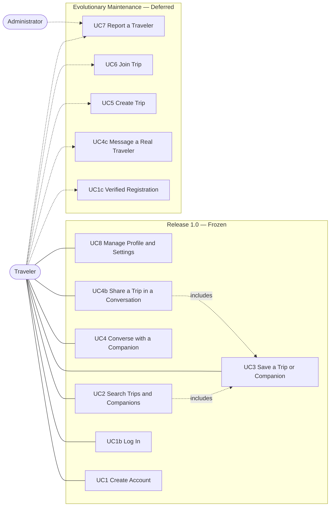

# 3.4.2 Use Case Model

> **Scope note:** Use cases are written in the language of the domain; implementation classes are named only in the separate *Realised by* line, which exists for V-Model traceability and is not part of the use case itself. `[R1.0 – Frozen]` use cases are delivered by this lifecycle; `[EM – Deferred]` use cases require the remote backend or real second users.

## Use Case Diagram

## Primary Use Cases

### UC1: Create Account `[R1.0 – Frozen]`

**Name:** CreateAccount
**Participating actor:** Traveler

**Entry condition:** The Traveler is at the login screen and chooses to create a new account.

**Flow of events:**
1. The system presents a form requesting a travel identity — name, surname, description — together with interest and trip tags, a profile photo, and the credentials that will admit the Traveler in future.
2. The Traveler fills in the identity fields and optionally adds interest and trip tags.
3. The Traveler optionally chooses a profile photo from the device.
4. The Traveler supplies a username and a secret, then submits the form.
5. The system validates every field and, if any is unacceptable, reports the specific problem beside that field and awaits correction.
6. On acceptance the system records the credentials in a non-recoverable form, stores the travel identity, and admits the Traveler to the application.

**Exit condition:** The Traveler is admitted to the application under the newly created identity; any previously stored account has been replaced.

*Realised by:* `CreateAccountScreen`, `AuthService.createAccount`, `AccountValidation`.

### UC1b: Log In `[R1.0 – Frozen]`

**Name:** LogIn
**Participating actor:** Traveler

**Entry condition:** The Traveler opens the application, which presents the login screen. An account already exists — one is provided on first installation.

**Flow of events:**
1. The Traveler supplies a username and a secret and submits them.
2. The system compares the username with the stored account, disregarding letter case.
3. The system checks the supplied secret against the stored account without ever recovering the original secret.
4. If both match, the system admits the Traveler; otherwise it reports that the credentials were not recognised and remains on the login screen.

**Exit condition:** The Traveler is admitted to the application, or is informed of the failure and may retry.

*Realised by:* `LoginScreen`, `AuthService.authenticate`, `AccountRepository.authenticate`.

### UC1c: Verified and Federated Registration `[EM – Deferred]`

**Name:** VerifiedRegistration
**Participating actor:** Traveler

**Entry condition:** The Traveler wishes to register an identity recognised across devices.

**Flow of events:** The system verifies ownership of an email address, or delegates identity to an external provider, and supports recovery of a forgotten secret.

**Exit condition:** A verified, platform-wide account exists for the Traveler.

### UC2: Search Trips and Companions `[R1.0 – Frozen]`

**Name:** SearchTripsAndCompanions
**Participating actor:** Traveler

**Entry condition:** The Traveler is admitted to the application and opens the search function.

**Flow of events:**
1. The Traveler selects whether to search trips or companions.
2. The Traveler enters a free-text query.
3. The system retains only the candidates matching every term of the query, ranks them by how closely and where they match, and breaks ties alphabetically.
4. The system presents the ranked results, or states that nothing matched.
5. The Traveler selects a result to examine it in detail.

**Exit condition:** A ranked list is presented and, if the Traveler selected one, its details are shown.

*Realised by:* `SearchScreen`, `SearchResultsScreen`.

### UC3: Save a Trip or Companion `[R1.0 – Frozen]`

**Name:** SaveBookmark
**Participating actor:** Traveler

**Entry condition:** The Traveler is examining a trip or a companion.

**Flow of events:**
1. The Traveler requests that the item be saved.
2. If the item was not already saved, the system records it among the Traveler's saved items; if it was, the system removes it.
3. The system confirms the outcome and updates the saved indicator shown on the item.

**Exit condition:** The item is present among the Traveler's saved items, or has been removed from them.

*Realised by:* `SaveTripButton`, `SavedTripPreviewStore`.

### UC4: Converse with a Companion `[R1.0 – Frozen]`

**Name:** ConverseWithCompanion
**Participating actor:** Traveler

**Entry condition:** The Traveler is examining a companion and chooses to converse with them.

**Flow of events:**
1. The system presents the conversation held with that companion so far, or an invitation to begin if there is none.
2. The Traveler composes and sends a message.
3. The system records the message and, after a brief pause, produces the companion's response based on the content of the message.
4. The system shows the companion as present while the exchange is active, and as absent once the Traveler has been inactive for a short period.
5. The Traveler may discard the entire conversation at any time.

**Exit condition:** The exchange is recorded and will be presented again on a later visit, unless the Traveler discarded it.

> In Release 1.0 the companion is not a second real person: the response is produced by the system from the companion's own characteristics.

*Realised by:* `ChatScreen`, `ChatStore`.

### UC4b: Share a Trip in a Conversation `[R1.0 – Frozen]`

**Name:** ShareTripInConversation
**Participating actor:** Traveler

**Entry condition:** The Traveler is conversing with a companion and has at least one saved trip.

**Flow of events:**
1. The Traveler asks to share a trip.
2. The system presents the trips the Traveler has saved.
3. The Traveler chooses one, and the system adds it to the conversation as an invitation.
4. The companion accepts or declines according to whether the trip's character matches their own travel preferences, and the response is added to the conversation.

**Exit condition:** The invitation and the companion's response are part of the conversation.

*Realised by:* `ChatTripAttachmentPicker`, `trip_invite.dart`.

### UC4c: Message a Real Traveler `[EM – Deferred]`

**Name:** MessageRealTraveler
**Participating actors:** Traveler (sender), Traveler (recipient)

**Entry condition:** Two registered Travelers are connected through the platform.

**Flow of events:** A message is delivered to the recipient, who is notified, opens it, and replies; the sender sees that it was read.

**Exit condition:** The message is delivered and its reading is reflected to the sender.

### UC5: Create Trip `[EM – Deferred]`

**Name:** CreateTrip
**Participating actor:** Traveler

**Entry condition:** The Traveler wishes to organise a journey and invite others.

**Flow of events:** The Traveler describes the journey — title, destination, dates, budget, itinerary, and the number of companions sought — and publishes it, obtaining a shareable reference.

**Exit condition:** The trip is published and discoverable by other Travelers.

> Release 1.0 offers a fixed catalog of trips and no means of creating one.

### UC6: Join Trip `[EM – Deferred]`

**Name:** JoinTrip
**Participating actor:** Traveler

**Entry condition:** The Traveler has found a published trip organised by someone else.

**Flow of events:** The Traveler requests to join; the organiser reviews the request and accepts or refuses it; if accepted the Traveler joins the group and its conversation.

**Exit condition:** The Traveler is a participant of the trip, or the request is pending or refused.

### UC7: Report a Traveler `[EM – Deferred]`

**Name:** ReportTraveler
**Participating actors:** Traveler, Administrator

**Entry condition:** A Traveler encounters behaviour that violates the community rules.

**Flow of events:** The Traveler states a reason and submits a report; an Administrator examines it together with the relevant history and issues a warning or a suspension.

**Exit condition:** The report is recorded and the Administrator's decision has been applied.

> No reporting or blocking function exists in Release 1.0.

### UC8: Manage Profile and Settings `[R1.0 – Frozen]`

**Name:** ManageProfileAndSettings
**Participating actor:** Traveler

**Entry condition:** The Traveler is admitted to the application and opens the settings function.

**Flow of events:**
1. The Traveler may revise their own travel identity — name, description, photo, and tags — and confirm or abandon the changes.
2. The Traveler may adjust their privacy preferences.
3. The Traveler may consult the frequently asked questions or request assistance.
4. The Traveler may review everything they have saved.
5. The Traveler may leave the application, returning it to the login screen.

**Exit condition:** The revised identity and preferences are retained and will be presented again on a later visit.

*Realised by:* `SettingsScreen`, `PersonalProfileScreen`, `PrivacySettingsScreen`, `SupportScreen`.

> Blocking other Travelers and permanently erasing one's data are not available in Release 1.0: there are no other real Travelers to block, and although registering again replaces the stored account, no explicit erasure function exists. Both remain `[EM – Deferred]`.
