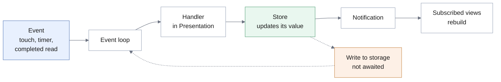

# 3.6 Global Software Control

## Control mechanism

TravelMate is **event-driven**: the application does not execute a predetermined sequence but waits and reacts.

| Mechanism | Verdict | Rationale |
|-----------|---------|-----------|
| **Event-driven** | **Adopted** | The order of operations is decided by the Traveler, not by the program. This is the mechanism conventionally applied to graphical interfaces, and the one the implementation framework imposes. |
| Procedure-driven | Rejected | Would require the program to decide when input is needed, which an interactive application cannot do: the Traveler may abandon a search to open settings and then return. |
| Thread-based | Rejected | One user, one process, and no work whose parallel execution would be observable. The costs — synchronisation and non-deterministic behaviour — would be incurred without the benefit. |

## Event cycle

A single **event loop** takes the next event and delivers it to its handler. The handler calls an operation on the store owning the affected state; the store changes its value and **publishes** the change, and every subscribed view rebuilds from the new value.

The store also requests that the Persistence subsystem write the new value, **without awaiting completion**. The write becomes further work for the event loop, and the interface has already been updated when it runs — the decision behind [NFR-P.2](../../rad/proposed-system/non-functional/performance).

Three kinds of event drive the system:

- **Interaction** — the Traveler touching, typing or navigating.
- **Scheduled expiry** — the two timed behaviours of the domain: the pause before a companion replies ([FR-D.1.2](../../rad/proposed-system/functional)), realised as a delayed continuation, and the interval of inactivity after which a companion is shown as absent ([FR-D.1.5](../../rad/proposed-system/functional)), realised as a cancellable timer.
- **Completion of an asynchronous operation** — a read or write finishing and its continuation resuming.

## Location of control

The dispatcher is the framework's event loop, which the application does not write. What the design settles is where the control logic for a use case lives.

The analysis model assigned one control object per use case ([RAD 3.4.3.4](../../rad/proposed-system/system-models/object-model)). The design does **not** preserve that mapping. Control is realised in two places:

- **Stores**, which own the state a use case affects and the operations that change it. Control is grouped here **by the state it governs** rather than by use case, since several use cases affect the same state and duplicating the rules for changing it would be the worse decomposition.
- **Screen event handlers**, which sequence the steps of one use case and hold state meaningful only while it is in progress — a partly filled form, a pending selection.

The property the one-control-per-use-case heuristic secures is preserved: for any given use case, the decisions about its flow are in one place. What changed is which place, not how many.

The rules of the domain are in neither: they are pure functions in the Domain Logic subsystem, called by stores and handlers. A store decides *when* to rank search results; it does not decide *how* they rank.

## Concurrency

The application runs in a **single thread of execution**. Asynchronous operations do not run in parallel with it: they suspend and resume as events on the same loop.

**No mutual exclusion is required.** A critical section can be interrupted only at a suspension point, and no two handlers execute simultaneously, so the race conditions that thread-based control requires locks to prevent cannot arise.

**Storage is the one shared resource.** Several operations may have writes in flight at once, since none is awaited. They are serialised through the shared database connection specified in [3.4](./persistent-data), which is the whole of the concurrency control the design provides — subject to the caveat recorded there about the connection's lazy creation.

The standard design questions concerning concurrency — which components can operate without interfering, which activities warrant separate threads, whether several users must be served at once, whether a request decomposes into parallel sub-tasks — do not arise in a system with one user and no parallelisable work.

The two timed behaviours are not concurrent activity: both are scheduled events on the same loop. Each companion has at most one presence timer, and starting a new one cancels the pending one, so a stale timer cannot mark a companion absent while an exchange is still active.

### One computation exceeds a frame

The claim that no computation is long enough to justify parallel execution holds with a single exception, recorded here because it qualifies the rejection of thread-based control.

**Credential derivation blocks the interface for its duration.** The derivation of [3.5](./access-control) is deliberately expensive — 100 000 iterations — and is performed synchronously on the single thread. [NFR-P.3](../../rad/proposed-system/non-functional/performance) permits up to 1 s for it, which is some sixty frames during which the interface cannot repaint. No work in the system is delegated to a background isolate.

The consequence is confined: the derivation occurs only at login and registration, where the Traveler has just submitted a form and a brief pause is expected rather than surprising, and it affects no other operation. It is nevertheless the one place where the single-threaded model is visible to the Traveler. Moving the derivation to a background isolate would remove it, and would not alter the control model — the result would return as another completion event on the same loop.

## Goals and requirements served

| Serves | How |
|--------|-----|
| [DG-P1](../introduction/design-goals) Responsiveness | Views update on notification; writes never block the interface. Credential derivation is the recorded exception |
| [DG-U1](../introduction/design-goals) Directness | Any function may be invoked at any time, since no sequence is imposed |
| [DG-M1](../introduction/design-goals) Testability | Control lives in stores and pure functions, both exercisable without a device |
| [NFR-P.2](../../rad/proposed-system/non-functional/performance) | The write is not awaited |
| [NFR-R.6](../../rad/proposed-system/non-functional/reliability) | Writes serialised through the shared connection of [3.4](./persistent-data) |
| [FR-D.1.2](../../rad/proposed-system/functional), [FR-D.1.5](../../rad/proposed-system/functional) | The two timed behaviours realised as scheduled events |
