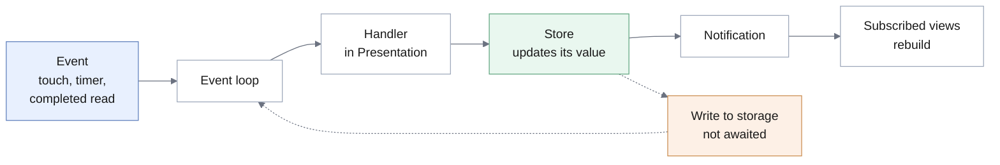

# 3.6 Global Software Control

## The mechanism chosen

TravelMate is **event-driven**. The application does not execute a predetermined sequence; it waits, and reacts to what happens.

| Mechanism | Verdict |
|-----------|---------|
| **Event-driven** | **Adopted.** The system is an interactive application whose order of operations is decided by the Traveler, not by the program. This is the mechanism conventionally applied to graphical interfaces, and the one the implementation framework imposes. |
| Procedure-driven | Rejected. It would require the program to decide when input is needed, which is precisely what an interactive application cannot do: the Traveler may search, then abandon the search to open settings, then return. |
| Thread-based | Rejected. There is one user, one process, and no computation long enough to justify parallel execution. Threads would provide responsiveness the system already has, at the cost of synchronisation problems and non-deterministic behaviour. |

## The event cycle

A single **event loop** takes the next event and delivers it to its handler. The handler — an event handler of a screen — calls an operation on the store that owns the affected state. The store changes its value and **publishes** that it has changed; every view subscribed to it rebuilds from the new value.

The store also asks the Persistence subsystem to write the new value, **without waiting for the write to complete**. The write becomes another item of work for the event loop, and the interface has already been updated by the time it runs. This is the design decision behind [NFR-P.2](../../rad/proposed-system/non-functional/performance): the visible state never waits on storage.

Three kinds of event drive the system:

- **Interaction** — the Traveler touching, typing, or navigating.
- **Timer expiry** — the two temporal behaviours of the domain: the pause before a companion replies, and the interval of inactivity after which a companion is shown as absent ([FR-D.1.2](../../rad/proposed-system/functional), [FR-D.1.5](../../rad/proposed-system/functional)).
- **Completion of an asynchronous operation** — a read or write finishing, and its continuation being resumed.

## Where control resides

The dispatcher is the framework's event loop, which the application does not write. What the application decides is **where the control logic for a use case lives**, and the design settles this deliberately.

The analysis model assigned one control object per use case ([RAD 3.4.3.4](../../rad/proposed-system/system-models/object-model)). The design does **not** preserve that one-to-one mapping. Control objects are realised in two places:

- **Stores**, which own the state a use case affects and the operations that change it. Control is grouped here **by the state it governs** rather than by use case, because several use cases affect the same state and duplicating the rules for changing it across them would be the worse decomposition.
- **Screen event handlers**, which sequence the steps of one use case and hold whatever state is meaningful only while it is in progress — a partly filled form, a pending selection.

The divergence is recorded rather than concealed, and it respects the property the one-control-per-use-case heuristic exists to secure: for any given use case, the decisions about its flow are in **one** place. What changed is which place, not how many.

The rules of the domain are in neither: they are pure functions in the Domain Logic subsystem, called by stores and handlers. A store decides *when* to rank search results; it does not decide *how* they rank.

## Concurrency

The application runs in a **single thread of execution**. Asynchronous operations do not run in parallel with it — they suspend, and resume as events on the same loop. Two consequences follow, and they are the reason the concurrency section of this design is short rather than absent.

**There is no mutual exclusion to design.** A critical section can only be interrupted at a suspension point, and no two handlers execute simultaneously. The race conditions that thread-based control requires locks to prevent cannot arise.

**The one genuine concurrency hazard is storage, and it is addressed structurally.** Several operations may have writes in flight at once, since none of them waits. They are serialised by the single database connection of [3.4](./persistent-data), which is the whole of the concurrency control the system needs and what [NFR-R.6](../../rad/proposed-system/non-functional/reliability) requires.

The standard design questions concerning concurrency — which components can operate without interfering, which activities warrant separate threads, whether several users must be served at once, whether a request decomposes into parallel sub-tasks — are answered the same way: **no**, because there is one user, no computation exceeding a frame, and no work whose parallel execution would be observable. Introducing threads would incur their costs without their benefits.

The two timers are the closest thing to concurrent activity, and they are not concurrent either: they are scheduled events on the same loop. Each companion has at most one presence timer, and starting a new one cancels the pending one, so a stale timer cannot mark a companion absent while the exchange is still active.

## Goals and requirements served

| Serves | How |
|--------|-----|
| [DG-P1](../introduction/design-goals) Responsiveness | Views update on notification; writes never block the interface |
| [DG-U1](../introduction/design-goals) Directness | Any function may be invoked at any time, since no sequence is imposed |
| [DG-M1](../introduction/design-goals) Testability | Control lives in stores and pure functions, both exercisable without a device |
| [NFR-P.2](../../rad/proposed-system/non-functional/performance) | The write is not awaited |
| [NFR-R.6](../../rad/proposed-system/non-functional/reliability) | Writes serialised through one connection |
| [FR-D.1.2](../../rad/proposed-system/functional), [FR-D.1.5](../../rad/proposed-system/functional) | The two timed behaviours realised as scheduled events |
