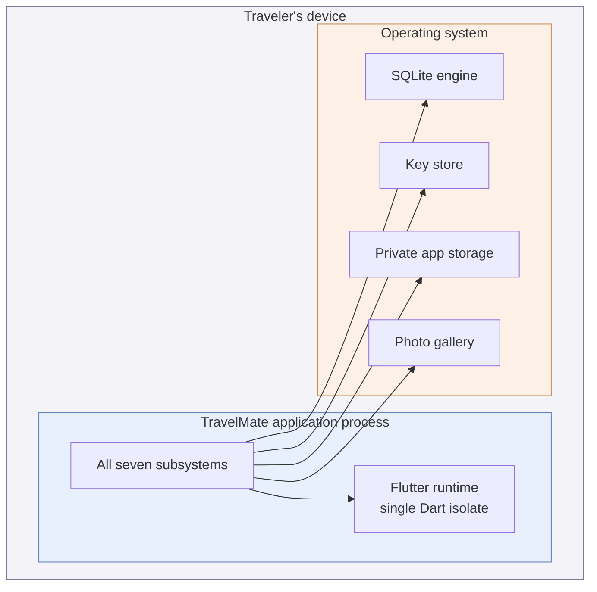

# 3.3 Hardware/Software Mapping

## Physical architecture

The system runs on **one node**: the Traveler's own device. There is no second node, no network topology, and no inter-node communication to design.

Every subsystem of [3.2](./subsystem-decomposition) is allocated to this single node and runs inside a single process. The questions this decision area normally poses — how many nodes, which node is responsible for which function, how nodes communicate, what bandwidth is required, whether a protocol is needed — have no content for this system, and inventing answers to them would describe a system that has not been built.

What the device must supply is limited and precise:

| Facility | Used for | Subsystem |
|----------|----------|-----------|
| Application-private storage directory | The database file and the copied photographs | Data Access, Media Storage |
| Key store / keychain | Holding the encryption key outside the application's own data | Security |
| Photo gallery | Supplying a photograph to copy | Media Storage |
| Display and touch input | All interaction | Presentation |

No permission beyond access to the photo gallery is required, and no network permission at all — which is itself the enforcement of [NFR-L.1](../../rad/proposed-system/non-functional/legal).

## Target platforms

The implementation framework compiles from a single body of logic to several platforms, and the repository carries the scaffolding for all of them. This is not the same as supporting them.

**The design targets mobile devices, and Android is the platform against which it is verified** — the reference device declared in [RAD 3.3.3](../../rad/proposed-system/non-functional/performance). iOS is supported by the same design: every facility used is available there, under a different name.

The desktop and web scaffolding present in the repository is **not supported**, and the design does not claim it. On the web in particular two facilities the design depends on are absent: the browser offers no SQLite engine of the kind used here, and no key store with the guarantees required by [3.5](./access-control). A web release would need a different persistence and key strategy, which this lifecycle does not design.

## Off-the-shelf components

Building persistence, cryptography, and image selection from scratch was rejected under [DG-C1](../introduction/design-goals). Each is realised by an established component.

| Component | Provides | Subsystem | Isolated behind |
|-----------|----------|-----------|-----------------|
| `sqflite` | The relational storage engine | Data Access | The DAO interfaces |
| `shared_preferences` | The key–value preference store | Persistence | The data-source interfaces |
| `encrypt` | AES-256-GCM authenticated encryption | Security | The cipher component |
| `pointycastle` | PBKDF2 key derivation | Security | The credential-hashing component |
| `flutter_secure_storage` | Access to the OS key store | Security | `SecureKeyStore` |
| `path_provider` | Resolution of the private storage directory | Data Access, Media Storage | — |
| `image_picker` | Selection of a photograph from the gallery | Media Storage | The picker adapter |
| `flutter_svg` | Rendering of vector illustrations | Presentation | — |

### Encapsulation

Every component that could be replaced is reached through an interface the application declares, not through its own API. The pattern is the same in each case: a **thin adapter** implements the application's interface by delegating to the component, and nothing above the adapter names the component.

This is what makes the substitutions of [3.2](./subsystem-decomposition) possible, and it is also how the risk the slides associate with off-the-shelf components — a supplier changing, or a component being withdrawn — is contained: the replacement would be a new adapter, not a change to the system.

Two components are deliberately *not* isolated. `path_provider` returns a directory path and nothing else; wrapping it would add an interface without hiding a decision. `flutter_svg` is a rendering widget, confined to Presentation, which is the layer designed to change most freely.

The adapters are the parts of the system that cannot be exercised without a device, and they are consequently excluded from coverage measurement rather than counted as untested logic — a choice recorded in the analysis configuration and justified by the fact that the logic they wrap is tested against substitutes.

## Goals and requirements served

| Serves | How |
|--------|-----|
| [DG-D1](../introduction/design-goals) Confidentiality | The key store is an OS facility, not application storage |
| [DG-M1](../introduction/design-goals) Testability | Adapters are the only device-dependent code, and are thin enough to be excluded honestly |
| [DG-C1](../introduction/design-goals) Economy | Persistence, cryptography and image selection are integrated rather than built |
| [NFR-I.1](../../rad/proposed-system/non-functional/implementation) | The framework constraint is honoured, and the single node is what it targets |
| [NFR-I.2](../../rad/proposed-system/non-functional/implementation) | Every facility used is local; the system requires no network permission |
| [NFR-Int](../../rad/proposed-system/non-functional/interface) (3.3.6) | The only external facilities used are the OS key store and the gallery, reached through the platform's documented mechanisms |
