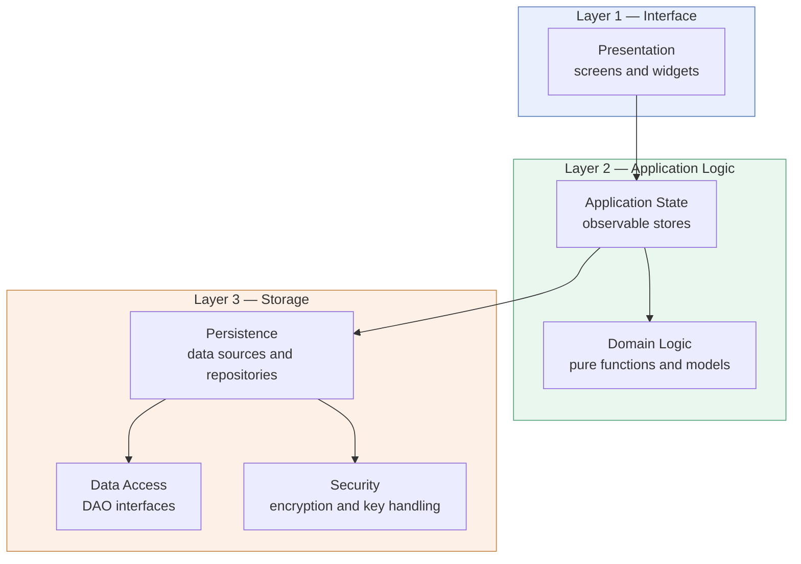

# 3.1 Overview

## The style chosen

TravelMate is built as a **closed three-layer architecture**, with the **Model–View–Controller** pattern governing the relationship between the upper two layers.

**Layer 1 — Interface** presents the system to the Traveler and collects their input. It realises the boundary objects of [RAD 3.4.3.3](../../rad/proposed-system/system-models/object-model).

**Layer 2 — Application Logic** holds the state of the running application and the rules of the domain. It realises the control objects of [RAD 3.4.3.4](../../rad/proposed-system/system-models/object-model), and the entity objects as the values it holds.

**Layer 3 — Storage** makes state outlive the running application, and protects it while stored.

The layering is **closed**: each layer addresses only the layer immediately below it. The interface never reaches storage, and storage never calls back into logic. Closed layering is chosen over open layering because the goal it serves — maintainability, a change to one layer having bounded and predictable effect — is design goal [DG-4](../introduction/design-goals), while the efficiency that open layering buys is not needed at these data volumes ([DG-6](../introduction/design-goals) is met with margin).

## Why this style, and not another

The decomposition into subsystems is difficult to change once development is under way, so the choice was made deliberately among the established styles rather than by default.

| Style | Verdict | Reason |
|-------|---------|--------|
| **Three-layer** | **Adopted** | The system has exactly the three concerns the style separates: an interface, a body of application logic, and persistent state. The separation is what makes the logic testable without a device ([DG-3](../introduction/design-goals)) and the storage mechanism replaceable ([DG-4](../introduction/design-goals)). |
| **MVC** | **Adopted, within layers 1–2** | The application is interactive, and several views present the same state — the profile appears in the settings summary, the editor, and the companion-facing card. MVC is the style for exactly that situation, and its subscribe/notify mechanism keeps the model ignorant of its views. |
| **Repository** | **Adopted in part** | The database is a shared structure that several subsystems depend upon. The problem the style warns against — every subsystem addressing the store directly, so that a change to it propagates everywhere — is avoided by interposing a single storage layer, as the style prescribes. It is *not* adopted as a whole-system style: subsystems do not communicate through the store, they communicate through their interfaces. |
| **Client/Server** | **Rejected** | Presupposes a server. There is none, and building one is outside the scope of this lifecycle. |
| **Peer-to-Peer** | **Rejected** | Presupposes several nodes. There is one. |
| **Pipes and Filters** | **Rejected** | Suits a stream transformed in successive stages. TravelMate is interactive and state-driven, not a transformation pipeline. |

## How MVC is realised

The **Model** is the set of observable stores in layer 2, each holding one kind of application state. The **View** is the widget tree of layer 1. The **Controller** is not a separate object: in this framework a widget both renders and receives input, so the controller role is played by the event handlers of the views, which call operations on the stores.

The essential property of MVC is preserved: **the model does not know its views**. A store publishes that its value has changed; every view that has subscribed rebuilds itself from the new value. Adding a view requires no change to the store.

This is also where the Repository style contributes. A store, on being changed, both notifies its views *and* asks the persistence layer to write the new value — without waiting for the write to finish. The visible state therefore updates within one frame while the write proceeds behind it, which is how [NFR-P.2](../../rad/proposed-system/non-functional/performance) is met.

## Goals and requirements served

| Serves | How |
|--------|-----|
| [DG-3](../introduction/design-goals) Testability | Layer 2 depends on abstractions declared in layer 3, never on the storage engine, so it can be exercised against in-memory substitutes |
| [DG-4](../introduction/design-goals) Isolation of storage | Closed layering forbids layer 1 from reaching layer 3 at all |
| [DG-5](../introduction/design-goals) Openness to a network tier | A remote implementation of the layer-3 interfaces would be invisible to layers 1 and 2 |
| [DG-6](../introduction/design-goals) Responsiveness | Views update on notification, independently of the write that follows |
| [NFR-S.2](../../rad/proposed-system/non-functional/supportability) | Business logic separated from storage and from presentation |
