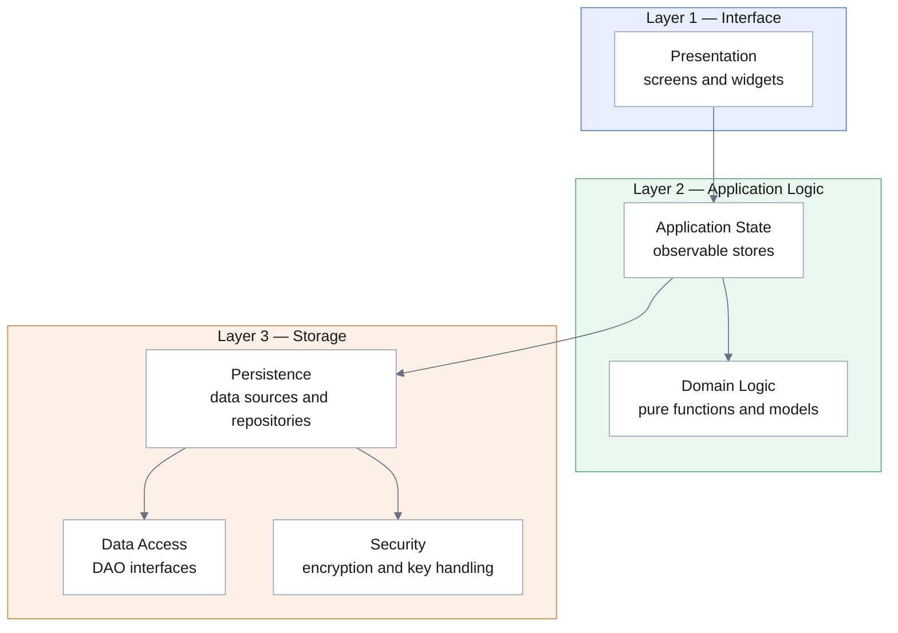

# 3.1 Overview

## Architectural style

TravelMate adopts a **closed three-layer architecture**, with the **Model–View–Controller** pattern governing the relationship between the upper two layers.

**Layer 1 — Interface** presents the system to the Traveler and collects input. It realises the boundary objects of [RAD 3.4.3.3](../../rad/proposed-system/system-models/object-model).

**Layer 2 — Application Logic** holds the state of the running application and the rules of the domain. It realises the control objects of [RAD 3.4.3.4](../../rad/proposed-system/system-models/object-model), and the entity objects as the values it holds.

**Layer 3 — Storage** makes state outlive the running application and protects it while stored.

The layering is **closed**: each layer addresses only the layer immediately below it. The interface does not reach storage, and storage does not call back into logic. Closed layering is preferred to open layering because the property it provides — a change to one layer having bounded and predictable effect — corresponds to design goal [DG-M2](../introduction/design-goals), whereas the efficiency gained by open layering is not required at these data volumes, [DG-P1](../introduction/design-goals) being met with margin.

## Selection of the architectural style

A decomposition into subsystems is costly to revise once development is under way, since the interfaces between subsystems would have to change with it. The established styles were therefore evaluated against the design goals before the decomposition was fixed.

| Style | Verdict | Rationale |
|-------|---------|-----------|
| **Three-layer** | **Adopted** | The system presents exactly the three concerns the style separates: an interface, a body of application logic, and persistent state. The separation is what renders the logic testable without a device ([DG-M1](../introduction/design-goals)) and the storage mechanism replaceable ([DG-M2](../introduction/design-goals)). |
| **MVC** | **Adopted, within layers 1–2** | The application is interactive, and several views present the same state: the profile appears in the settings summary, in the profile editor, and in the profile card. The pattern addresses this case directly, and its subscribe/notify mechanism keeps the model independent of the views presenting it. |
| **Repository** | **Adopted in part** | The database is a structure on which several subsystems depend. The condition the style guards against — each subsystem addressing the store directly, so that a change to the store propagates throughout — is avoided by interposing a single storage layer. The style is not adopted as a whole-system organisation: subsystems communicate through their interfaces, not through the store. |
| **Client/Server** | **Rejected** | Presupposes a server component, which is outside the scope of this lifecycle. |
| **Peer-to-Peer** | **Rejected** | Presupposes multiple nodes; the system runs on one. |
| **Pipes and Filters** | **Rejected** | Suited to data transformed in successive stages. The system is interactive and state-driven rather than a transformation pipeline. |

## Realisation of the MVC pattern

The **Model** is the set of observable stores in layer 2, each holding one kind of application state. The **View** is the widget tree of layer 1. The **Controller** is not a distinct object: in this framework a widget both renders and receives input, so the controller role is performed by the event handlers of the views, which invoke operations on the stores.

The defining property of the pattern is preserved: **the model holds no reference to its views**. A store publishes that its value has changed, and every subscribed view rebuilds from the new value. Introducing a further view requires no change to the store.

The write path follows the Repository style. On being changed, a store notifies its views and, in the same operation, requests that the Persistence subsystem write the new value, without waiting for the write to complete. The visible state is therefore updated within one frame while the write proceeds independently, satisfying [NFR-P.2](../../rad/proposed-system/non-functional/performance).

## Goals and requirements served

| Serves | How |
|--------|-----|
| [DG-M1](../introduction/design-goals) Testability | Layer 2 depends on abstractions declared in layer 3, never on the storage engine, and can therefore be exercised against in-memory substitutes |
| [DG-M2](../introduction/design-goals) Isolation of storage | Closed layering precludes layer 1 from addressing layer 3 |
| [DG-M3](../introduction/design-goals) Openness to a network tier | A remote implementation of the layer-3 interfaces would be invisible to layers 1 and 2 |
| [DG-P1](../introduction/design-goals) Responsiveness | Views update on notification, independently of the write that follows |
| [NFR-S.2](../../rad/proposed-system/non-functional/supportability) | Business logic separated from storage and from presentation |
