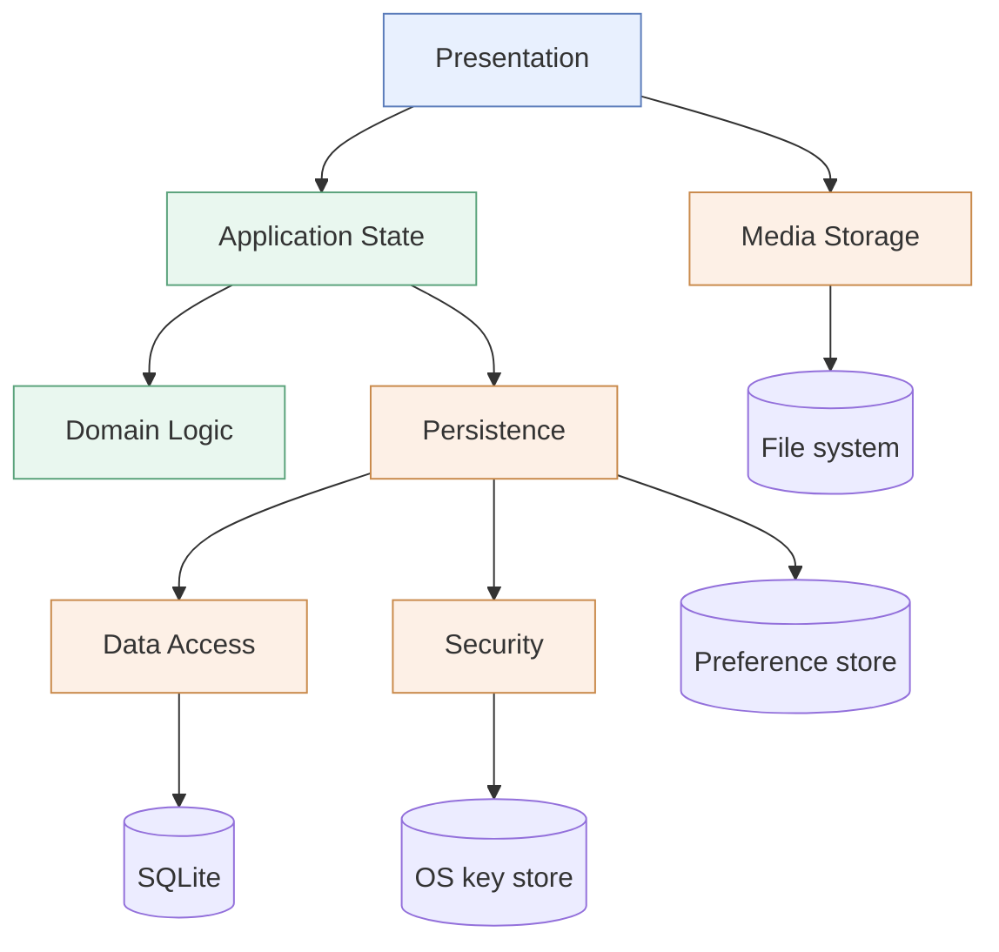

# 3.2 Subsystem Decomposition

The system is decomposed into **seven subsystems**, distributed across the three layers of [3.1](./overview). Each corresponds to a directory of the source tree, so that the architecture can be read directly from the code and cannot silently diverge from it.

## The subsystems

| Subsystem | Layer | Responsibility | Source |
|-----------|-------|----------------|--------|
| **Presentation** | 1 | Presents the system and collects input: screens, reusable widgets, navigation, visual conventions | `features/`, `shared/widgets/`, `core/theme/`, `core/constants/` |
| **Application State** | 2 | Holds the state of the running application and publishes its changes | `shared/state/` |
| **Domain Logic** | 2 | Decides domain questions, holding no state: matching, ranking, validation, reply selection | `shared/utils/`, `shared/models/` |
| **Persistence** | 3 | Decides where each kind of data lives, translates between domain objects and stored rows, applies encryption | `shared/data/` |
| **Data Access** | 3 | Issues storage commands and owns the database connection | `core/database/` |
| **Security** | 3 | Encrypts, decrypts, derives credential values, and obtains the key | `core/security/` |
| **Media Storage** | 3 | Stores photographs as files and yields the reference by which they are found | `features/profile/image/` |

## Component diagram

Two dependencies deserve comment because they appear to breach the closed layering.

**Presentation → Media Storage** crosses from layer 1 to layer 3. It is admitted deliberately: choosing a photograph is initiated by the operating system's own picker, which returns a file the application must copy before the reference to it becomes meaningful. Routing that file through layer 2 would gain nothing, since no application state is involved until the resulting *path* — which is what layer 2 stores — exists. The exception is confined to one operation and is recorded here rather than left implicit.

**Persistence → preference store** bypasses Data Access. This is not an exception but a consequence of [3.4](./persistent-data): two kinds of data are held in the platform's key–value preference store rather than in the database, and for those the Data Access subsystem has nothing to contribute.

## Layering and partitioning

The decomposition combines both organising techniques.

**Layering** is vertical and its dependencies are one-directional: layer 1 addresses layer 2, layer 2 addresses layer 3, and no layer addresses the one above it. Nothing in Application State knows that a screen exists; nothing in Persistence knows that a store exists.

**Partitioning** is horizontal within layers 2 and 3. Application State and Domain Logic are peers, as are Persistence, Data Access, Security and Media Storage. Peers are not, however, mutually dependent here: Domain Logic is addressed by Application State and addresses nothing, and among the layer-3 partitions only Persistence addresses the others. The resulting dependency graph is acyclic, which is stronger than the style requires and is what allows any subsystem to be tested with the ones below it replaced.

## Cohesion

Each subsystem was formed by grouping what changes together and for the same reason.

**Domain Logic is the most cohesive**, and deliberately so. It contains only functions that compute an answer from their arguments: how well a trip matches a query, whether a companion would accept a proposal, which reply corresponds to a message, whether a submitted field is acceptable. None of them holds state, reads storage, or knows the interface exists. This is the subsystem whose contents are the rules of the domain, and it is the easiest in the system to test — which is why the rules were put there rather than left inside the screens that invoke them.

**Security is cohesive by mechanism** rather than by feature: it is everything that concerns keys and ciphers, and nothing else. Grouping it this way means that the question *how is data protected?* has exactly one place to be answered, as required for a policy that must be uniform across subsystems.

**Presentation is the least cohesive**, and this is accepted. It contains screens belonging to unrelated features together with the widgets and visual conventions they share. Splitting it per feature would raise cohesion but multiply the interfaces between the parts, since the widgets are shared across features — the trade-off the slides describe, resolved here in favour of fewer interfaces. Presentation is also the layer most tolerant of change, so the cost of lower cohesion is lowest here.

## Coupling, and how it is kept low

Coupling is controlled by a single mechanism applied consistently: **a subsystem depends on an interface declared by the subsystem below it, never on that subsystem's implementation.**

| Interface | Declared by | Implemented by | What it hides |
|-----------|-------------|----------------|---------------|
| `ProfileDao`, `ChatDao`, `AccountDao`, `TripDao` | Data Access | An SQLite implementation, and an in-memory one in tests | That the store is a relational database |
| `SecureKeyStore` | Security | An OS-key-store adapter, and an in-memory one in tests | That the key comes from the operating system |
| `ProfileDataSource`, `ChatDataSource` | Persistence | The current implementation, and in-memory ones in tests | Which mechanism holds this kind of data |

The consequence is the property the Repository style exists to obtain, and the one the slides state as the test of low coupling: **if the storage engine were replaced, only the Data Access subsystem would change.** Persistence, Application State, Domain Logic and Presentation would not be touched, because none of them names the engine.

The same mechanism yields testability. Every subsystem above layer 3 can be exercised with the platform facilities replaced by in-memory substitutes, which is why the logic can be tested without a database engine, a key store, or a device.

The cost is the one the slides identify: a level of indirection that would not otherwise exist, and more declarations than a direct call would need. It is accepted because the storage mechanism has already changed once ([2](../current-architecture)) and is expected to change again.

## Goals and requirements served

| Serves | How |
|--------|-----|
| [DG-M1](../introduction/design-goals) Testability | Every platform facility sits behind an interface that a test can satisfy |
| [DG-M2](../introduction/design-goals) Isolation of storage | Only Data Access names the storage engine |
| [DG-M3](../introduction/design-goals) Openness to a network tier | A remote implementation of the data-source interfaces would be invisible above layer 3 |
| [NFR-S.2](../../rad/proposed-system/non-functional/supportability) | Logic separated from storage and presentation |
| [NFR-S.3](../../rad/proposed-system/non-functional/supportability) | Components depend on abstractions rather than platform services |
| [NFR-S.7](../../rad/proposed-system/non-functional/supportability) | A new function is added within one subsystem |
