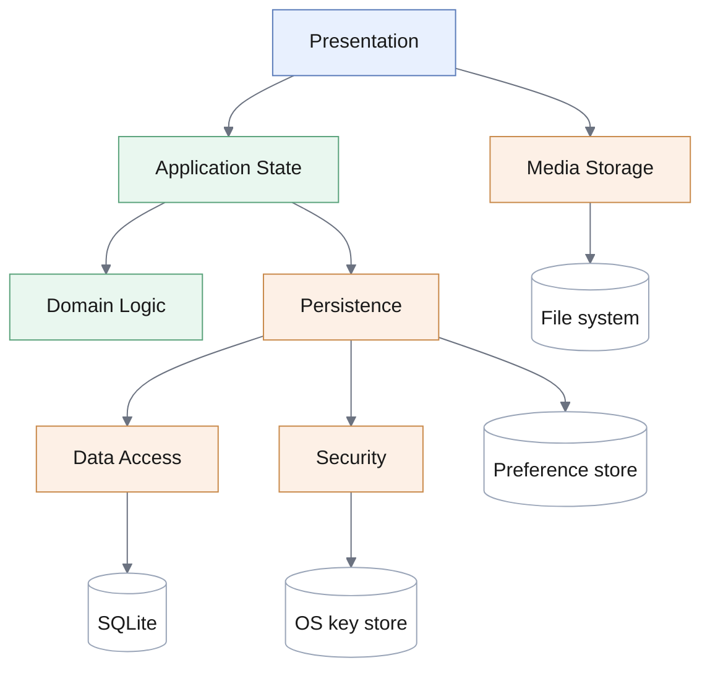
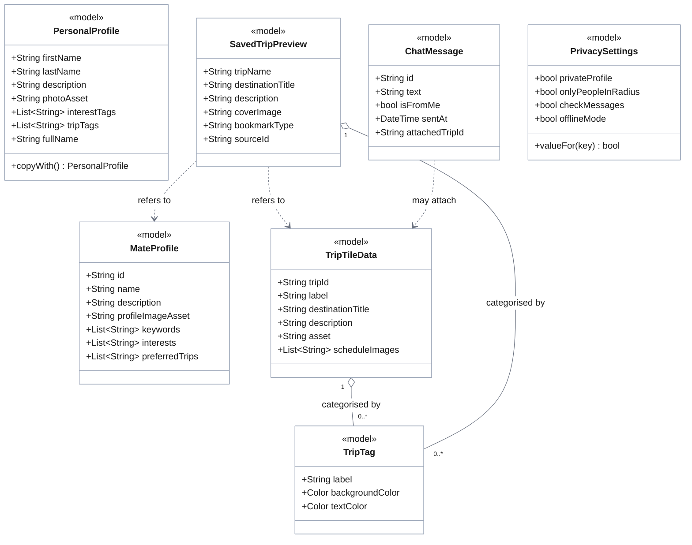
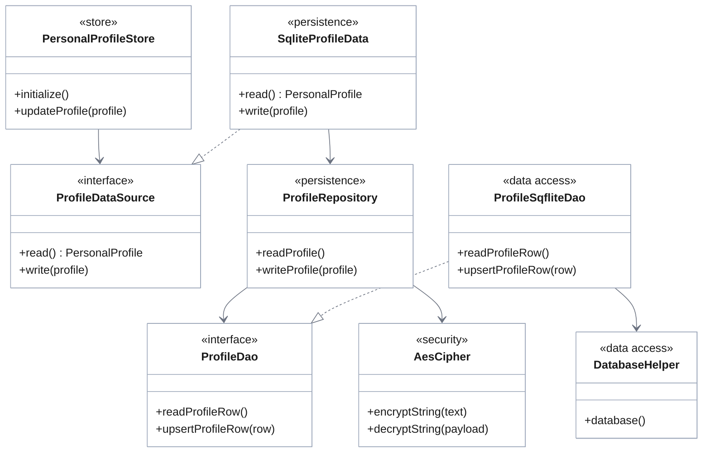
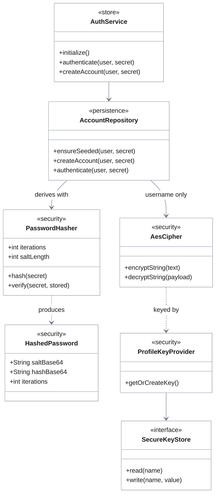

# 3.2 Subsystem Decomposition

The system is decomposed into **seven subsystems**, distributed across the three layers of [3.1](./overview). Each corresponds to a directory of the source tree, so that the architecture can be read directly from the code and cannot silently diverge from it.

## Subsystems

| Subsystem | Layer | Responsibility | Source |
|-----------|-------|----------------|--------|
| **Presentation** | 1 | Presents the system and collects input: screens, reusable widgets, navigation, visual conventions | `features/`, `shared/widgets/`, `core/theme/`, `core/constants/` |
| **Application State** | 2 | Holds the state of the running application and publishes its changes | `shared/state/` |
| **Domain Logic** | 2 | Decides domain questions, holding no state: matching, ranking, validation, reply selection | `shared/utils/`, `shared/models/` |
| **Persistence** | 3 | Decides where each kind of data lives, translates between domain objects and stored rows, applies encryption | `shared/data/` |
| **Data Access** | 3 | Issues storage commands and owns the database connection | `core/database/` |
| **Security** | 3 | Encrypts, decrypts, derives credential values, and obtains the key | `core/security/` |
| **Media Storage** | 3 | Stores photographs as files and yields the reference by which they are found | `features/profile/image/` |

## Component diagram

Two dependencies appear to breach the closed layering and are therefore stated explicitly.

**Presentation → Media Storage** crosses from layer 1 to layer 3. It is admitted deliberately: choosing a photograph is initiated by the operating system's own picker, which returns a file the application must copy before the reference to it becomes meaningful. Routing that file through layer 2 would serve no purpose, since no application state is involved until the resulting *path* — which is what layer 2 stores — exists. The exception is confined to this single operation.

**Persistence → preference store** bypasses Data Access. This is not an exception but a consequence of [3.4](./persistent-data): two kinds of data are held in the platform's key–value preference store rather than in the database, and for those the Data Access subsystem has nothing to contribute.

## Layering and partitioning

The decomposition combines both organising techniques. The allocation of subsystems to layers, established in [3.1](./overview), is restated here for reference:

| Layer | Subsystems |
|-------|------------|
| **Layer 1 — Interface** | Presentation |
| **Layer 2 — Application Logic** | Application State, Domain Logic |
| **Layer 3 — Storage** | Persistence, Data Access, Security, Media Storage |

**Layering** is vertical and its dependencies are one-directional: layer 1 addresses layer 2, layer 2 addresses layer 3, and no layer addresses the one above it. Nothing in Application State knows that a screen exists; nothing in Persistence knows that a store exists.

**Partitioning** is horizontal within layers 2 and 3, as the table above shows: Application State and Domain Logic are peers within layer 2, and Persistence, Data Access, Security and Media Storage are peers within layer 3. Peers are not, however, mutually dependent here: Domain Logic is addressed by Application State and addresses nothing, and among the layer-3 partitions only Persistence addresses the others. The resulting dependency graph is acyclic, which is stronger than the style requires and is what allows any subsystem to be tested with the ones below it replaced.

## Cohesion

Each subsystem was formed by grouping what changes together and for the same reason.

**Domain Logic exhibits the highest cohesion.** It contains only functions that compute an answer from their arguments: how well a trip matches a query, whether a companion would accept a proposal, which reply corresponds to a message, whether a submitted field is acceptable. None holds state, reads storage, or has knowledge of the interface. Its contents are the rules of the domain, and it is the subsystem most readily tested; the rules are therefore located here rather than within the screens that invoke them.

**Security is cohesive by mechanism** rather than by feature: it comprises everything concerning keys and ciphers, and nothing else. The grouping gives the question *how is data protected?* a single point of answer, as required for a policy that must be uniform across subsystems.

**Presentation exhibits the lowest cohesion**, which the design accepts. It contains screens belonging to unrelated features together with the widgets and visual conventions they share. Dividing it per feature would raise cohesion but multiply the interfaces between the parts, since the widgets are shared across features — the standard trade-off between cohesion and the number of interfaces, resolved here in favour of fewer interfaces. Presentation is also the layer most tolerant of change, so the cost of lower cohesion is smallest here.

## Coupling

Coupling is controlled by a single mechanism applied consistently: **a subsystem depends on an interface declared by the subsystem below it, never on that subsystem's implementation.**

| Interface | Declared by | Implemented by | What it hides |
|-----------|-------------|----------------|---------------|
| `ProfileDao`, `ChatDao`, `AccountDao`, `TripDao` | Data Access | An SQLite implementation, and an in-memory one in tests | That the store is a relational database |
| `SecureKeyStore` | Security | An OS-key-store adapter, and an in-memory one in tests | That the key comes from the operating system |
| `ProfileDataSource`, `ChatDataSource` | Persistence | The current implementation, and in-memory ones in tests | Which mechanism holds this kind of data |

The consequence is the property the Repository style exists to obtain, and the standard test of low coupling: **if the storage engine were replaced, only the Data Access subsystem would change.** Persistence, Application State, Domain Logic and Presentation would not be touched, because none of them names the engine.

The same mechanism yields testability. Every subsystem above layer 3 can be exercised with the platform facilities replaced by in-memory substitutes, which is why the logic can be tested without a database engine, a key store, or a device.

The cost is the one the technique carries: a level of indirection that would not otherwise exist, and more declarations than a direct call would require. It is accepted because the storage mechanism is a point of variation: [3.4](./persistent-data) selects a different mechanism for each kind of data, and a release acquiring a network tier would change the selection again.

## Goals and requirements served

| Serves | How |
|--------|-----|
| [DG-M1](../introduction/design-goals) Testability | Every platform facility sits behind an interface that a test can satisfy |
| [DG-M2](../introduction/design-goals) Isolation of storage | Only Data Access names the storage engine |
| [DG-M3](../introduction/design-goals) Openness to a network tier | A remote implementation of the data-source interfaces would be invisible above layer 3 |
| [NFR-S.2](../../rad/proposed-system/non-functional/supportability) | Logic separated from storage and presentation |
| [NFR-S.3](../../rad/proposed-system/non-functional/supportability) | Components depend on abstractions rather than platform services |
| [NFR-S.7](../../rad/proposed-system/non-functional/supportability) | A new function is added within one subsystem |

## UML class diagram

The object-level view of the decomposition is given in two diagrams: the domain model held by the upper layers, and the structure through which layer 3 stores and protects it. Each class carries a stereotype naming its subsystem, so both diagrams can be read against the table in [Subsystems](#subsystems).

### Domain model

The values the application holds and presents. These classes carry data and derived properties only: no storage, no encryption, no knowledge of the interface.

`SavedTripPreview` records the kind of item it refers to in `bookmarkType` and identifies it by `sourceId`, which is how a single collection holds trips and companions together ([FR-C.1.3](../../rad/proposed-system/functional)). The two dependencies shown are therefore alternatives, never both at once.

### Profile persistence

The path by which one kind of state reaches storage. The **profile** is shown as the exemplar; the conversation and trip-catalogue verticals follow the identical shape, each with its own data source, repository and DAO.

### Credentials and key management

Credentials do not follow the path above, because they are never recovered. `AccountRepository` sends the secret to a one-way derivation and encrypts only the username.

Three properties established earlier in this section are visible across the two diagrams:

- Every crossing between subsystems passes through an **interface** — `ProfileDataSource`, `ProfileDao`, `SecureKeyStore` — never through a concrete class. Each has a second implementation used in tests, which is what makes [DG-M1](../introduction/design-goals) attainable.
- **`AesCipher` is reached only from repositories.** No store, screen or DAO is connected to it, which is what makes the protection policy of [3.5](./access-control) uniform by construction rather than by convention.
- **Credentials do not pass through the cipher.** The secret reaches `PasswordHasher`, which is one-way; only the username is encrypted. This is the distinction [3.5](./access-control) draws between concealment and non-recoverability.

The diagrams show the classes of the **delivered** system. Trip creation and editing, group membership and moderation belong to the deferred requirements of [RAD 3.2](../../rad/proposed-system/functional) and have no classes here. Full signatures, types, visibility and contracts belong to the [ODD](../../odd/classes).
